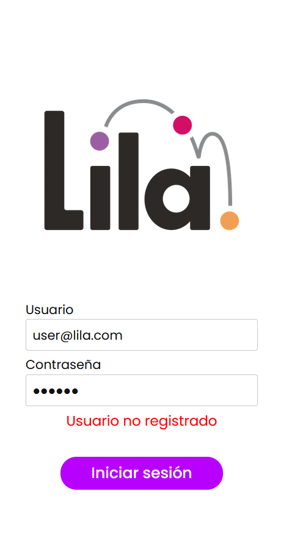
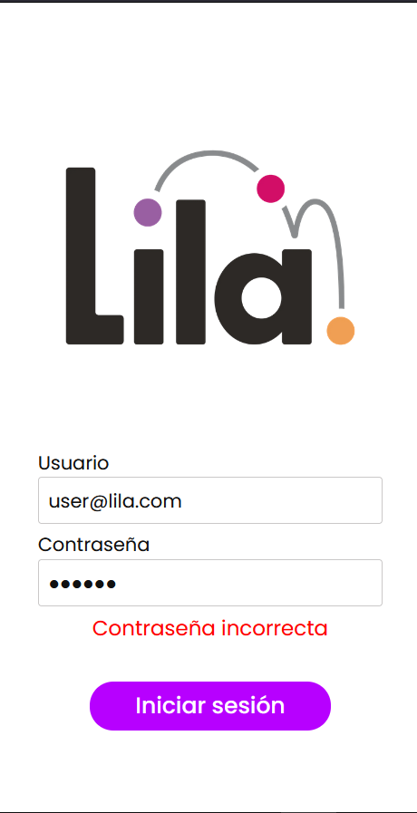
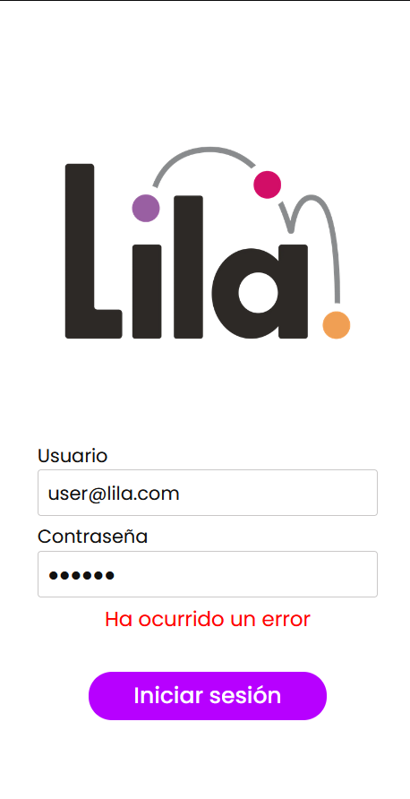
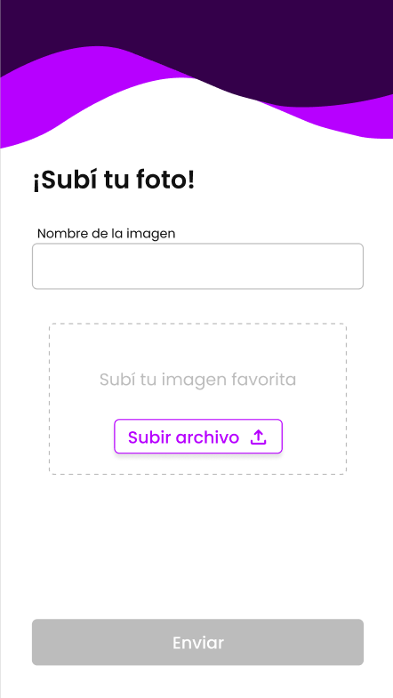
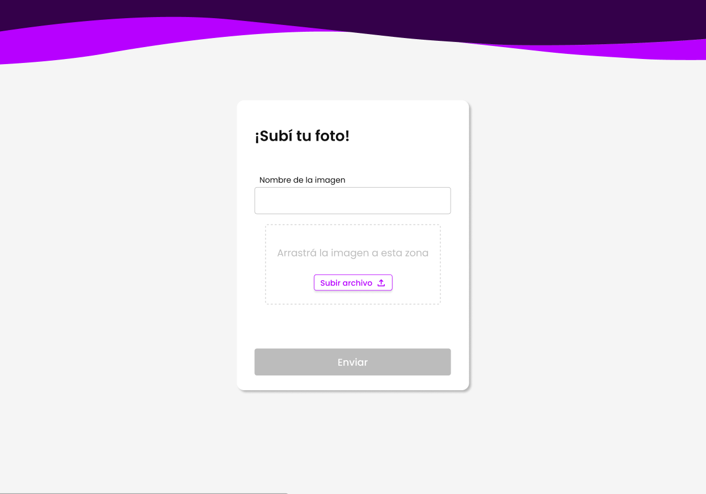

# Lila Frontend Challenge

Este es un desafío de programación diseñado para poner a prueba tus habilidades de React, CSS, buenas prácticas y criterio.

En el repo vas a encontrar código incompleto para una pantalla de login y un formulario para subir fotos. Tu tarea va a ser completar la app siguiendo las instrucciones de este archivo.

El desafío consta de varias tareas repartidas por el código. Las vas a encontrar comentadas como `ToDo`. La idea es que completes todas las que puedas. Si hay algo que no podés resolver, simplemente dejalo incompleto y seguí con otras partes del desafío. Podés agregar comentarios explicando tu problema si querés.

A continuación están las instrucciones del desafío. Algunas partes ya están implementadas, otras no. Tu tarea consiste en completar las que no están implementadas aún.

### Instrucciones

1. La pantalla de login (`http://localhost:3000/auth/login`) permite ingresar email y contraseña.
2. Al completar ambos campos, se activa el botón de "Iniciar sesión". Al presionar el botón, se consulta al backend si el usuario es correcto.
3. Se debe mostrar en la pantalla un mensaje distinto en cada caso:

| Éxito                                              | Usuario no registrado                           | Contraseña incorrecta                           | Otro error                                       |
| -------------------------------------------------- | ----------------------------------------------- | ----------------------------------------------- | ------------------------------------------------ |
|  |  |  |  |

4. Tras un login exitoso, el usuario debe ser redireccionado a la página del formulario (`http://localhost:3000/`).
5. El usuario sólo debe poder ingresar a esta página si está logueado. En caso de que el usuario no esté logueado, automáticamente debe ser redirigido a la pantalla de login.
   Esta validación está implementada en el componente de primer orden [`withAuth`](./utils/auth/withAuth.jsx). Su uso es similar a otros High Order Components como withRouter o withReducer.
6. En la pantalla del formulario, el usuario debe poder ingresar un nombre y subir una foto. El formulario debe ser responsive y verse como se detalla en el siguiente [Figma](https://www.figma.com/file/To3P20ST6fowk2I5kQRCEd/Lila-Frontend-Challenge?node-id=0%3A1&t=Gdm4LTgM1B70TerQ-1). Podés exportar los assets que necesites desde Figma y consultar CSS útil para algunos elementos.

| Mobile                                    | Desktop                                |
| ----------------------------------------- | -------------------------------------- |
|  |  |

7. En la versión desktop, el usuario debe poder arrastrar la foto al recuadro o seleccionar una manualmente. Cuando el usuario agregó la imagen, debe verse un preview de la foto en la pantalla.
8. Cuando estos dos campos están llenos, se debe activar el botón "Enviar". Si alguno de los dos campos está vacío, el botón debe estar desactivado.
9. En el campo de archivos, el usuario debe poder subir únicamente un solo archivo de tipo imagen.
10. Al subir el formulario, se debe mostrar un mensaje al usuario indicando si fue exitoso u ocurrió algún error. Podés mostrar este mensaje como más te guste: como en el login, con un toast, con un alert, etc...
11. Desafío Opcional: un último **desafío opcional** consiste en hacer que el usuario pueda subir múltiples fotos en simultaneo. En este caso, deberías mostrar una preview de cada imagen, luego enviar al backend un arreglo de fotos y modificar la validación de las fotos en la API Route. En Figma hay también un ejemplo del diseño para este caso.

La documentación de la API de backend se encuentra en [APIARY](https://lilafrontendchallenge.docs.apiary.io). Algunos de los servicios que consumen los endpoints ya están implementados, pero esta documentación te puede servir para saber con qué formato enviar los datos a cada endpoint.

Con fines de practicidad, este repositorio no está conectado a un backend real, simplemente se implementaron mocked endpoints para el login y el formulario en las API Routes de Next.js. Podés modificar estas API Routes si necesitás (por ejemplo, para el desafío opcional).

#### Recomendaciones

- Usar un formateador de código.
- No dejar errores ni advertencias en el código. Usar un linter para detectarlos (o ejecutar `npm run lint`).
- No dejar errores ni advertencias en la consola del navegador.
- Usar PropTypes en los componentes.
- Intentar mantener el estilo de código del repositorio.
- Respetar al detalle el diseño propuesto.

## Getting Started

This is a [Next.js](https://nextjs.org/) project bootstrapped with [`create-next-app`](https://github.com/vercel/next.js/tree/canary/packages/create-next-app) and node@18.2.0 (works well in node@14 and higher).

First time you open this repo, install dependencies:

```bash
npm install
# or
yarn install
```

Then you can run the development server anytime you need:

```bash
npm run dev
# or
yarn dev
```

Open [http://localhost:3000](http://localhost:3000/template) with your browser to see the result.

You can start editing the page by modifying `pages/index.js`. The page auto-updates as you edit the file.

## Scaffolding

Add files in the `/pages` folder and they will be automatically mapped to new routes.

Put common use components in the `/components` folder and use the `/views` folder to save components related to a single view or page.

Use the `/services` folder to save your services related files and global constants files. Services should fetch from API routes and then API routes should interact with Backend endpoints. All API routes are in the `/pages/api` folder and each file is mapped to an API route endpoint.

The `/utils` folder can be used to store common use functions or custom libraries.

If you create custom React Hooks, you can save them on a `/hooks` folder.

## Documentation

[API routes](https://nextjs.org/docs/api-routes/introduction) can be accessed on [http://localhost:3000/api/hello](http://localhost:3000/api/hello). This endpoint can be edited in `pages/api/hello.js`.

The `pages/api` directory is mapped to `/api/*`. Files in this directory are treated as [API routes](https://nextjs.org/docs/api-routes/introduction) instead of React pages.

To learn more about Next.js, take a look at the following resources:

- [Next.js Documentation](https://nextjs.org/docs) - learn about Next.js features and API.
- [Learn Next.js](https://nextjs.org/learn) - an interactive Next.js tutorial.

You can check out [the Next.js GitHub repository](https://github.com/vercel/next.js/) - your feedback and contributions are welcome!

Check out the [Next.js deployment documentation](https://nextjs.org/docs/deployment) for more details about Next.js deployments.
